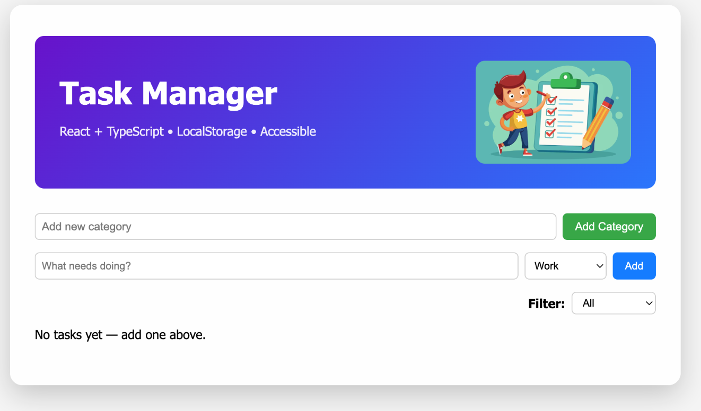

# Task Manager

A **simple, accessible, and user-friendly Task Manager** web app built with **React** and **TypeScript**.  
Organize your tasks into categories, mark them complete, and persist them in **localStorage**.

## Features

- Add, edit, and delete tasks  
- Organize tasks into categories (Work, Personal, Study, Other) and filter by category  
- Mark tasks as completed  
- Persistent storage using **localStorage**  
- Responsive design with color-coded categories and feedback messages  
- Accessible and easy-to-use interface  

---

## Demo

*(Optional: Add a link to a live demo if hosted online)*

---

## Installation

1. **Clone the repository**:

git clone https://github.com/your-username/task-manager.git
cd task-manager

2. **Install dependencies**:

npm install
# or
yarn install

3. **Run the development server**:
   
npm run dev
# or
yarn dev

4. Open your browser at **http://localhost:5173**

## Build

To create a production build:

npm run build
# or
yarn build

The production-ready files will be in the dist folder.

## Technologies

React – Frontend library

TypeScript – Type safety and better tooling

Vite – Fast dev server & build tool

SCSS – Styling

localStorage – Task persistence

